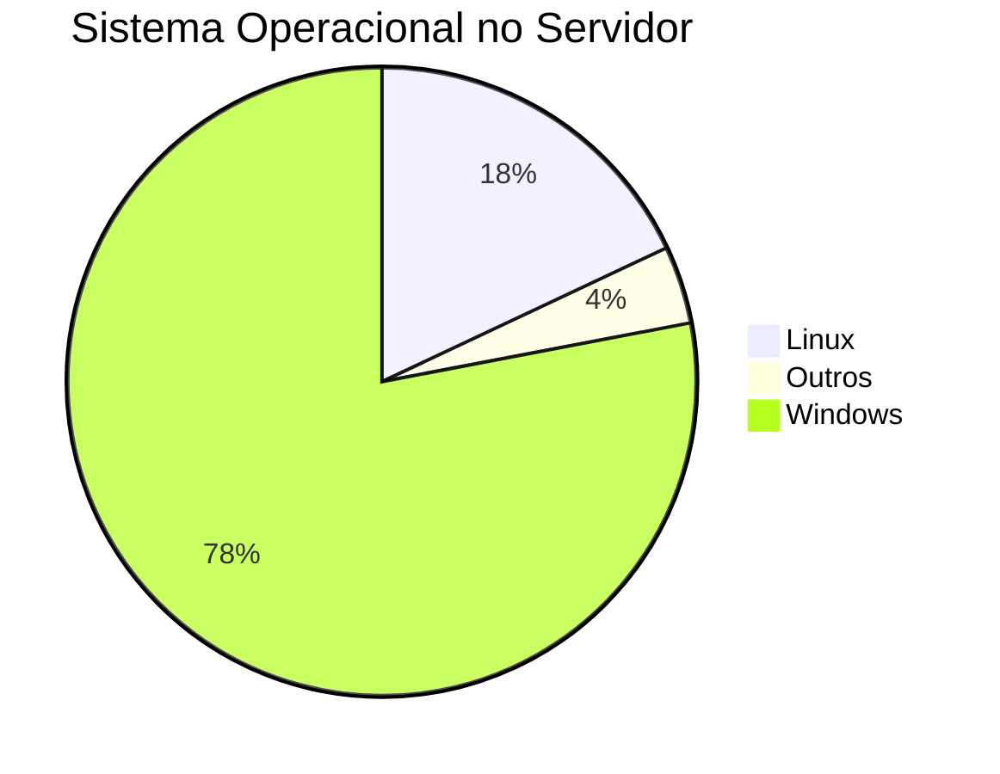
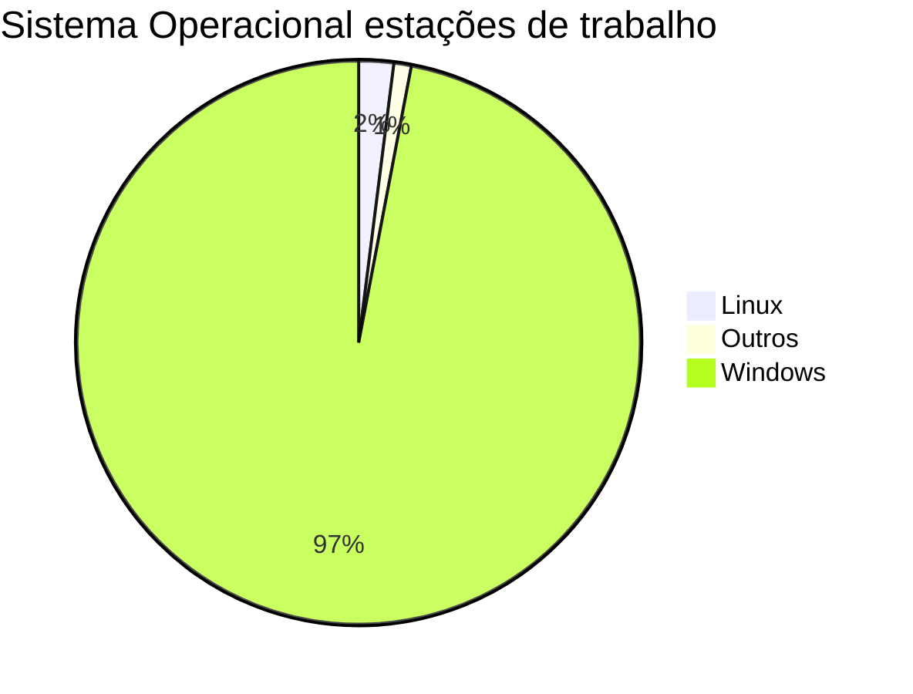
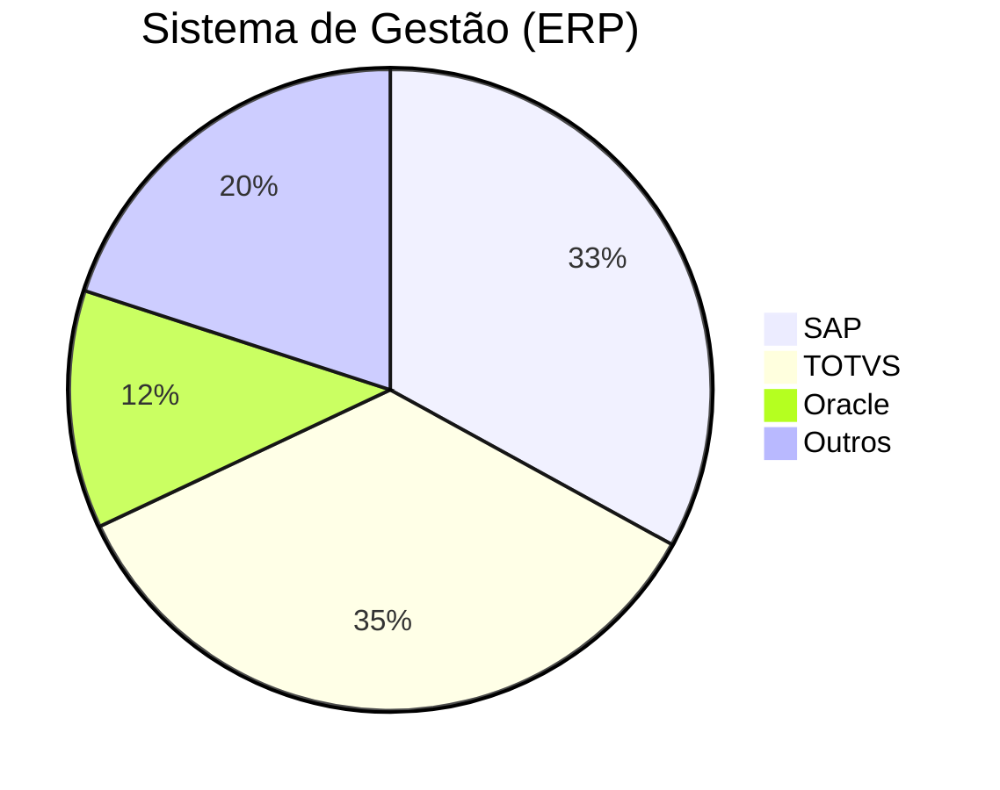
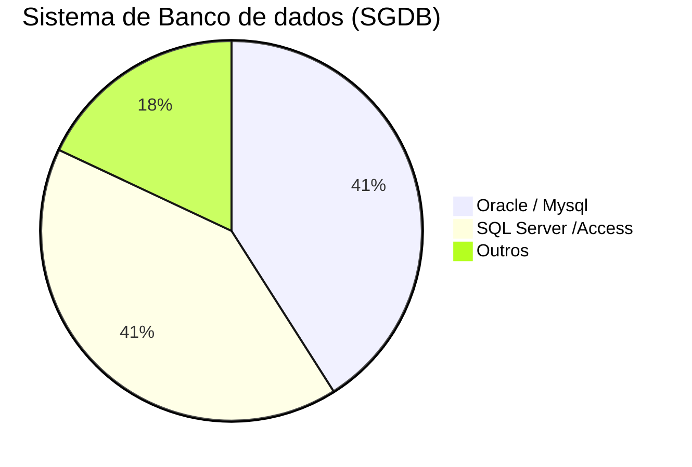
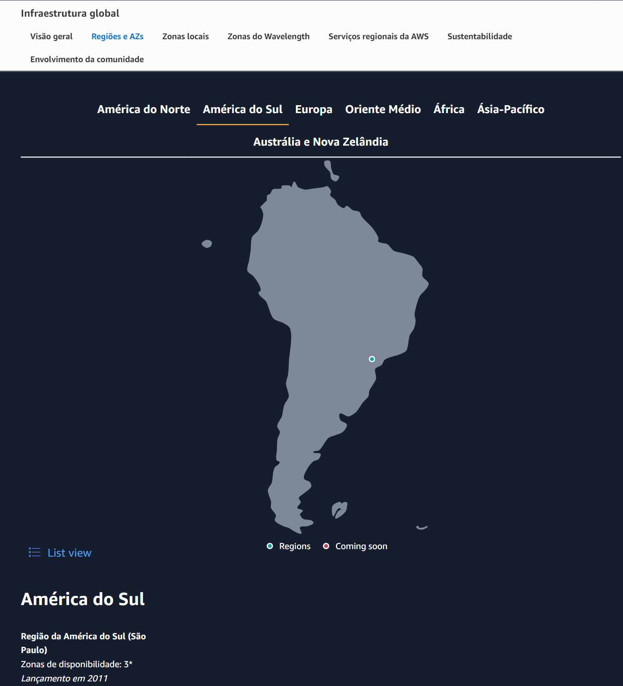
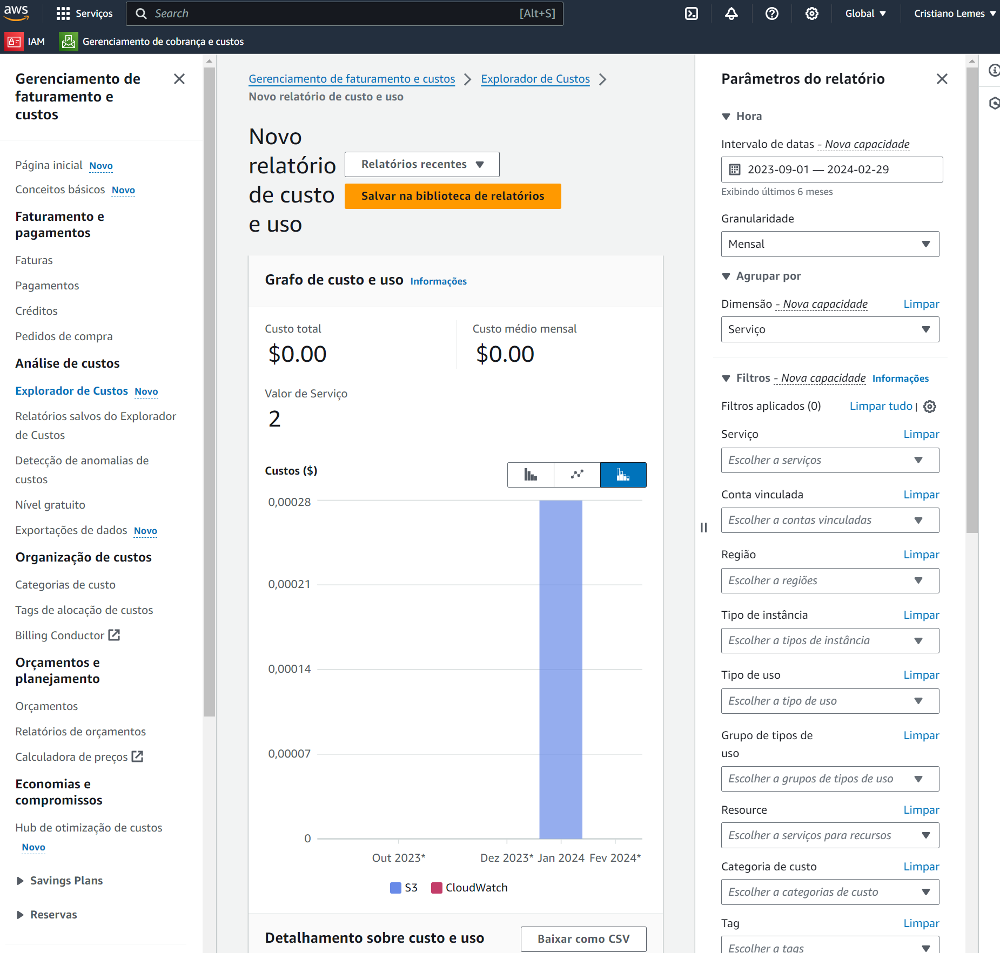
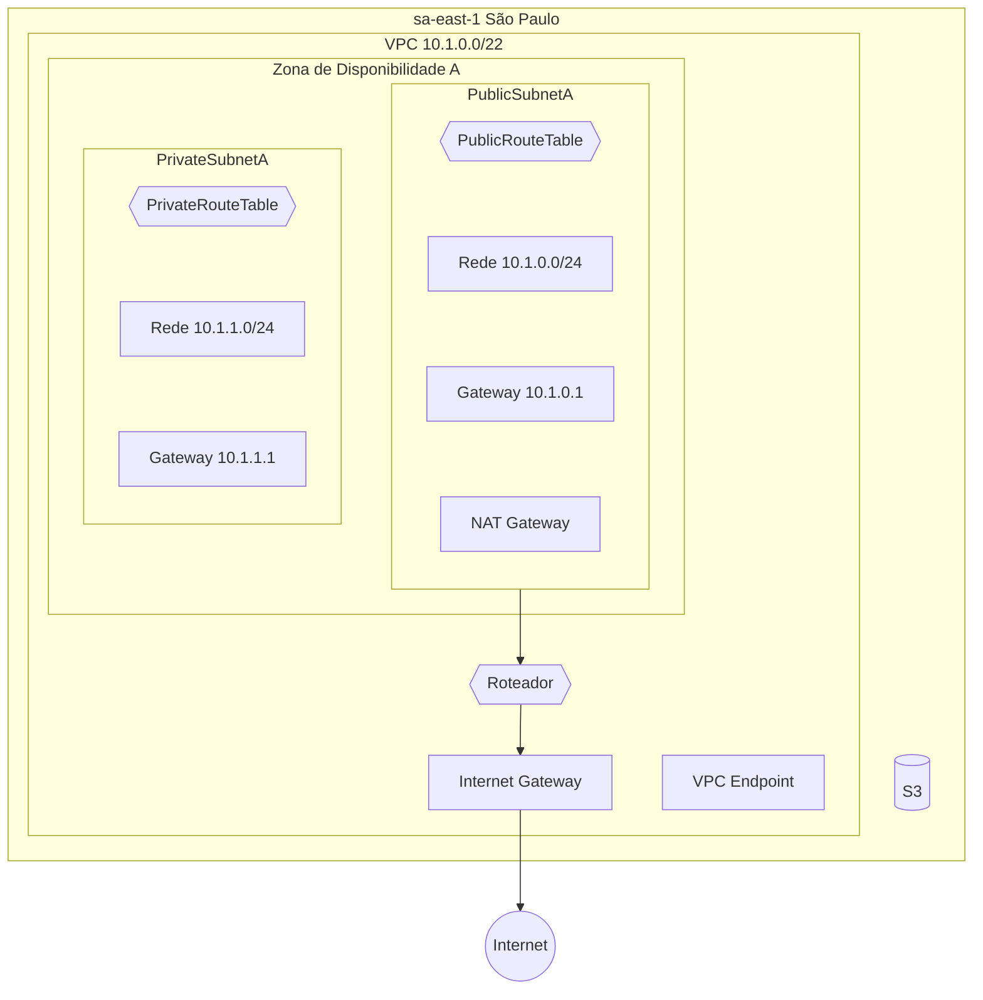

### Introdução

Neste artigo, vamos explorar os conceitos básicos da AWS na prática, utilizando um cenário real de migração para a nuvem.
Vamos utilizar uma variedade de serviços da AWS, incluindo IAM, EC2, EBS, S3, RDS, ELB, AWS Backup, VPC e Application Migration Service. 

#### Estabelecendo o cenário

Para deixar definir quais sistema a empresa vai usar, resolvi seguir as informações da [EAESP, da FGV](https://eaesp.fgv.br/producao-intelectual/pesquisa-anual-uso-ti), que elabora uma pesquisa anualmente para avaliar os recursos TI em uso nas empresas brasileiras.

De acordo com os dados coletados:

- *O SO mais usado em servidores é Windows.*

- *Nos desktops o Windows mantem a dominância.*

- *Sistemas ERP mais usados*

- *Gerenciadores de Banco de dados*

Levando em consideração esses dados, nossa empresa optou por seguir o padrão predominante, utilizando principalmente servidores e desktops Windows. Quanto ao ERP, adotamos uma abordagem baseada nos requisitos médios dos sistemas mais utilizados. É importante ressaltar que essas decisões são baseadas apenas em referências e não refletem necessariamente uma instalação e migração real dessas aplicações.
Ao longo deste artigo, vamos abordar como cada serviço da AWS pode ser utilizado para suportar esse cenário, garantindo uma migração suave e eficiente para a nuvem.

### Avaliando os Requisitos

#### Descrição da Empresa

Vamos considerar uma empresa de varejo, semelhante às Americanas ou Casas Bahia, com uma presença significativa em lojas físicas e um escritório central. Vamos chamar essa empresa de "VarejoMax".
**VarejoMax** é uma empresa de varejo que opera em 10 filiais, incluindo 5 em shopping centers, com lojas funcionando de segunda a sábado das 08:00 às 22:00 e os shopping centers de 14:00 às 22:00 no domingo. Cada loja possui 5 pontos de venda, totalizando 50 pontos de venda em todo o negócio, cada loja possui 2 usuários operacionais, 20 total. Além disso, o escritório possui 20 usuários Admistrativos.

#### Infraestrutura e Tecnologia
- **Sistemas de Ponto de Venda (POS)**: VarejoMax utiliza sistemas de ponto de venda avançados que integram com o sistema de gerenciamento de inventário e o sistema de ERP para fornecer uma visão unificada dos dados de vendas, estoque e finanças.
- **Sistema de Gerenciamento de Inventário**: Um sistema robusto que permite ao VarejoMax gerenciar o estoque de forma eficiente, otimizando a rotação de produtos e minimizando o desperdício.
- **Sistema de ERP**: Um sistema ERP personalizado que integra todos os processos de negócios, incluindo vendas, compras, finanças, logística e recursos humanos.

#### Desafios e Oportunidades
- **Desafios**: A principal desafio para VarejoMax é manter a eficiência operacional em um ambiente de varejo de alta rotação, onde a precisão e a velocidade são críticas. Além disso, a empresa enfrenta desafios relacionados à gestão de grandes volumes de dados gerados pelas transações de vendas e pela análise de dados.
- **Oportunidades**: VarejoMax vê oportunidades em áreas como a implementação de tecnologias de inteligência artificial (IA) e aprendizado de máquina para melhorar a experiência do cliente e otimizar as operações internas. A empresa também pode explorar oportunidades de expansão em novos mercados e a adoção de novas tecnologias de e-commerce.

#### Detalhando o ambiente

Considerando que nosso ERP, usando uma estimativa genérica, consome 200MB de RAM por usuário e a VarejoMax tem  35 usuários para o ERP, portanto:
- Cada usuário consome 200MB então 40 x 200 8000MB + 8196MB(Para o SO) = 16 GB no servidor de aplicação, colocando uma margem chegamos a 24 .
- 8vCPU, ele recomenda 4 CPU físicas para até 100 usuários, como vamos usar virtualização, então 8vCPU, 4 cores + HyperThread. 

| Servidor de Aplicação | Virtual        |
| --------------------- | -------------- |
| Sistema Operacional   | Windows Server |
| CPU                   | 8vCPU          |
| Mémoria RAM           | 24 GB          |
| Disco SO + PageFile   | 50GB           |
| Disco Dados           | 200 GB         |

***Aplicação Cliente***
O cliente (é uma aplicação cliente servidor), no momento é instalada em cada desktop da empresa.
- CPU: 5% a 30% de uso do processador.
- Memória RAM: 100 MB a 1 GB de memória.
- Rede: 1 MB a 10 MB de largura de banda por hora de uso.

Para o banco de dados do ERP, vamos usar o MySQL.
Os requisitos de CPU e memoria baseado em um ambiente de até 100 usuários, baseados na documentação padrão de ERP de mercado.
Temos 3 roles de usuários, cada tipo tem sua media de consumo mensal de banco.

| Role           | Qtd | Disco | Total /m | 5 Anos |
| -------------- | --- | ----- | -------- | ------ |
| Administrativo | 15  | 5 GB  | 75 GB    | 4,5 TB |
| Operações      | 20  | 2 GB  | 40 GB    | 2,5 TB |
| Financeiro     | 5   | 5 GB  | 25 GB    | 1,5 TB |

O Hardware do servidor ficou da seguinte forma:

| Banco de Dados      | Bare Metal |
| ------------------- | ---------- |
| Sistema Operacional | Debian     |
| CPU                 | 8 CPU      |
| Mémoria RAM         | 32 GB      |
| Disco SO SSD        | 100GB      |
| Disco Dados SAS     | 10,8 TB    |

***Para o servidor de aplicação do POS***
Os requisitos de CPU e memoria baseado em um ambiente de até 100 POS, baseados na documentação padrão de sistemas POS de mercado.

| Servidor de Aplicação | Virtual        |
| --------------------- | -------------- |
| Sistema Operacional   | Windows Server |
| CPU                   | 4vCPU          |
| Mémoria RAM           | 8 GB           |
| Disco SO + PageFile   | 50GB           |
| Disco Dados           | 200 GB         |

***Para o banco de dados do POS, vamos usar o Oracle.***

Para calcular o total de horas que a empresa "VarejoMax" fica aberta por mês, precisamos considerar o horário de funcionamento semanal e o número de semanas no mês. Vamos assumir que a empresa opera de segunda a sábado, com lojas funcionando de 08:00 às 22:00 e os shopping centers de 14:00 às 22:00 no domingo.

1. Cálculo das Horas por Semana

- **Lojas**: De segunda a sábado, as lojas funcionam por 14 horas (de 08:00 às 22:00). Isso resulta em 14 horas por dia * 5 dias = 70 horas por semana.
- **Shopping Centers**: No domingo, os shopping centers funcionam por 8 horas (de 14:00 às 22:00). Isso resulta em 8 horas por dia * 1 dia = 8 horas por semana.

2. Cálculo das Horas por Mês

- **Total de Horas por Semana**: 70 horas (lojas) + 8 horas (shopping centers) = 78 horas por semana.
- **Número de Semanas por Mês**: Um mês típico tem aproximadamente 4 semanas e 1 dia (4.33 semanas).

3. Cálculo das Horas por Mês

- **Total de Horas por Mês**: 78 horas por semana * 4.33 semanas = 347,44 horas por mês.

4. Estrutura de Dados
Para uma transação típica, podemos considerar os seguintes campos:

- **ID da Transação**: Um identificador único para cada transação.
- **ID do Cliente**: Um identificador para o cliente que realizou a transação.
- **Data e Hora da Transação**: A data e a hora em que a transação ocorreu.
- **Itens da Transação**: Uma lista de itens comprados, incluindo ID do item, quantidade e preço unitário.
- **Total da Transação**: O valor total da transação.

5. Estimativa de Espaço por Transação

Vamos assumir que cada campo tem um tamanho aproximado:

- **ID da Transação**: 10 bytes (assumindo um tipo de dados INT).
- **ID do Cliente**: 10 bytes (assumindo um tipo de dados INT).
- **Data e Hora da Transação**: 8 bytes (assumindo um tipo de dados DATETIME).
- **Itens da Transação**: Dependendo da quantidade de itens e dos detalhes armazenados para cada item, isso pode variar significativamente. Para uma estimativa, vamos assumir que cada item tem um ID de 10 bytes, uma quantidade de 2 bytes e um preço unitário de 5 bytes, totalizando 17 bytes por item. Se uma transação tiver, por exemplo, 5 itens, isso ocuparia 85 bytes.
- **Total da Transação**: 5 bytes (assumindo um tipo de dados DECIMAL).

6. Cálculo do Espaço Total por Transação

- **Espaço Total por Transação**: 10 bytes (ID da Transação) + 10 bytes (ID do Cliente) + 8 bytes (Data e Hora) + 85 bytes (Itens) + 5 bytes (Total) = 118 bytes por transação.

7. Estimava genérica cupons por hora

- 10 lojas x 20 cupons por hora: 200 cupons 
- total 23MB por hora

8. Resumo de consumo
   - 347,44 horas x 23 MB = 8 GB por mês
   - Em 5 anos 40 GB

| Banco de Dados      | Bare Metal |
| ------------------- | ---------- |
| Sistema Operacional | Centos     |
| CPU                 | 4 CPU      |
| Mémoria RAM         | 16 GB      |
| Disco SO SSD        | 100GB      |
| Disco Dados SAS     | 1,2 TB     |

***O que tem na empresa***
 - 1 Servidor de Aplicação Windows (Todas roles da aplicação ERP estão nesse servidor)
 - 1 Servido do sistema de POS
 - 1 Banco de dados Mysql
 - 1 Bando de dados Oracle
 - 1 Servidor de Arquivos Windows
 - 1 Servidor de Impressão Windows
 - 1 Active directory Windows
 - 1 Zabbix Linux
 - 1 DHCP 
 - 1 DNS Windows

***Diagrama da Empresa***

```mermaid


flowchart TB
classDef blue fill:#40e0d0
classDef green fill:#50c878
classDef yellow fill:#ffd700
classDef darkblue fill:#5c9dca
classDef olive fill:#556b2f
classDef orange fill:#e47025
classDef brow fill:#634217
classDef red fill:#ce5a57
classDef darkgrey fill:#444c5c
classDef darkyellow fill:#e1b16a

subgraph Datacenter
    direction TB
    ST[(Storage)]:::darkyellow
	FS<-.->ST
    subgraph Rede Privada      
      direction TB
      RT{{"Roteador"}}:::green   
      SW1[Switch TOR]:::orange
      FW[Firewall]:::red   
      RT -.-> SW1
      FW -.-> RT     
    end  
    subgraph HyperVisor
    direction TB      
       DNSP(DNS Privado)     
       RDP[\"Terminal Server"\]:::olive
       FS[\"Servidor de Arquivos"\]:::olive
       APP[\"Aplicação Web"\]:::olive
       APP1[\"Aplicação POS"\]:::olive
	   SW1 --> DNSP & RDP & FS & APP & APP1        
	end
    subgraph Bare Metal
      DB[("DB ERP Online")]:::darkgrey
      DB1[("DB POS Online")]:::darkgrey
      DBSTB[("DB ERP Stand-by")]:::darkgrey
      DB1STB[("DB POS Stand-by")]:::darkgrey
      APP-.->DB
      RDP-.->DB
      APP1-.->DB1
      DB --> DBSTB 
      DB1 --> DB1STB
	end
end

subgraph Escritorio
   direction TB
   RTE{{"Roteador"}}:::green 
   SWE["Switch"]:::orange
   USRE>"Usuarios"]:::darkblue
   USRE-.->SWE-.->RTE
end
subgraph Filiais
    direction TB
	RTF{{"Roteador"}}:::green 
	SWF["Switch"]:::orange
	USRF>"Usuarios"]:::darkblue
	USRF-.->SWF-.->RTF
end


MPLS("MPLS")
IE(("Internet"))
MPLS-.->FW 
RTF-.->MPLS
RTE-.->MPLS
IE<-.->FW
 

```

#### *Porque migrar?*

A migração para a computação em nuvem pode resolver vários problemas, melhorando significativamente a eficiência, segurança e escalabilidade dos sistemas de uma empresa. Vamos explorar alguns gaps comuns em infraestruturas on-premises a importância de cada um desses gaps e como a computação em nuvem pode abordá-los:

1. **Negócio**: A crescente demanda de uma empresa que excede a capacidade do ambiente atual é um indicativo claro de que a infraestrutura atual não está mais atendendo às necessidades do negócio. A migração para a nuvem permite escalar rapidamente os recursos conforme necessário, sem a necessidade de adquirir e manter hardware adicional. Isso não apenas reduz os custos de capital, mas também libera recursos para focar em outras áreas do negócio.

2. **Segurança Física**: A dependência de uma única chave para acesso aos servidores é um risco significativo de segurança. A computação em nuvem oferece soluções robustas de autenticação e autorização, incluindo a autenticação de dois fatores e a integração com sistemas de gerenciamento de identidade. Isso reduz o risco de acesso não autorizado e aumenta a segurança dos dados.

3. **Energia**: A dependência de um único fornecedor de energia e a falta de um sistema de backup de energia confiável são preocupações significativas. A computação em nuvem oferece redundância e alta disponibilidade, garantindo que os serviços estejam sempre disponíveis, mesmo em caso de falhas de energia ou problemas com o fornecedor de energia. Além disso, a computação em nuvem elimina a necessidade de manter infraestrutura física, incluindo servidores e sistemas de energia.

4. **Disponibilidade**: A migração para a nuvem pode melhorar significativamente a disponibilidade dos serviços. A computação em nuvem permite a replicação de dados e aplicativos em várias regiões geográficas, garantindo que os serviços estejam sempre disponíveis, mesmo em caso de falhas regionais.

5. **Escalabilidade**: A capacidade de escalar rapidamente os recursos conforme necessário é uma vantagem crucial da computação em nuvem. Isso permite que as empresas atendam às demandas de crescimento sem a necessidade de investir em infraestrutura adicional.

6. **Backup Local**: A dependência de backups locais pode ser um risco significativo, pois os dados podem ser perdidos ou corrompidos. A computação em nuvem oferece soluções de backup e recuperação de desastres robustas, garantindo que os dados estejam sempre seguros e acessíveis.

Em resumo, a migração para a computação em nuvem pode resolver muitos dos problemas identificados nos gaps mencionados, oferecendo soluções robustas de segurança, alta disponibilidade, escalabilidade e confiabilidade de backup. Isso não apenas melhora a eficiência operacional, mas também permite que as empresas se concentrem em suas principais prioridades de negócio.

#### O que é cloud computing?

O termo cloud computing (computação em nuvem), foi criado pelo US Nation Institute of Standards and Technology (NIST) apesar disso, sua definição é abragente a todo mundo. A definição do NIST é baseada em uma série de características e princípios que descrevem o que é computação em nuvem. Aqui está uma síntese da definição do NIST, conforme descrito na Publicação Especial 800-145:

1. **Acesso à Internet**: A computação em nuvem é caracterizada pelo acesso à internet, permitindo que os usuários acessem recursos de computação de forma conveniente e à demanda.

2. **Modelos de Serviço**: A computação em nuvem é oferecida através de um modelo de serviço que pode incluir infraestrutura como serviço (IaaS), plataforma como serviço (PaaS) e software como serviço (SaaS).

3. **Recursos Compartilhados**: Os recursos de computação são compartilhados entre vários usuários, permitindo que os recursos sejam rapidamente provisionados e liberados conforme necessário.

4. **Escalabilidade**: A computação em nuvem permite que os recursos sejam escalados rapidamente para atender às demandas dos usuários.

5. **Gestão de Serviços**: A gestão dos serviços de nuvem é realizada pelo provedor de serviços, reduzindo a necessidade de gestão de infraestrutura por parte dos usuários.

6. **Modelos de Implementação**: A computação em nuvem pode ser implementada de várias maneiras, incluindo nuvem pública, nuvem privada e nuvem híbrida.

7. **Segurança e Privacidade**: Embora a computação em nuvem ofereça benefícios significativos em termos de escalabilidade e conveniência, é crucial que os provedores de serviços implementem medidas de segurança e privacidade robustas para proteger os dados e informações dos usuários.

8. **Portabilidade**: Os aplicativos e dados armazenados na nuvem devem ser portáteis, permitindo que eles sejam facilmente movidos entre diferentes ambientes de nuvem conforme necessário.

A definição do NIST é bem sólida para entender o que é computação em nuvem, mostrando que é algo que pode ser usado em qualquer lugar do mundo, fácil de acessar e que se adapta bem. E claro, não podemos esquecer de falar sobre a segurança, privacidade e a facilidade de mover coisas de um lugar para outro.

#### Tipos de nuvens?

A computação em cloud pode ser categorizada em três tipos principais: nuvem pública, nuvem privada e nuvem híbrida. Cada um desses modelos tem características distintas que determinam como os dados e aplicativos são armazenados, gerenciados e acessados.

1. **Cloud Pública**: Neste modelo, os recursos de computação são fornecidos por um provedor de serviços de terceiros através da internet. A nuvem pública é acessível a qualquer pessoa com uma conexão à internet e oferece uma maneira econômica de acessar recursos de computação sem a necessidade de investir em infraestrutura própria. Exemplos de provedores de nuvem pública incluem Amazon Web Services (AWS), Google Cloud Platform (GCP) e Microsoft Azure.

2. **Cloud Privada**: A nuvem privada é uma infraestrutura de computação em nuvem dedicada a uma única organização. Ela é projetada para ser usada exclusivamente por essa organização, oferecendo um alto nível de controle sobre os dados e a infraestrutura. A nuvem privada pode ser hospedada internamente pela própria organização ou por um provedor de serviços de terceiros. Ela é comumente usada por empresas que têm requisitos de segurança ou regulatórios específicos que exigem um alto nível de controle sobre seus dados.

3. **Cloud Híbrida**: A nuvem híbrida combina recursos de nuvem pública e privada, permitindo que as organizações aproveitem os benefícios de ambas. Isso pode incluir o uso de recursos de nuvem pública para escalar rapidamente e lidar com picos de demanda, enquanto mantém dados sensíveis ou críticos em uma nuvem privada para garantir a segurança e o controle. A nuvem híbrida oferece flexibilidade e permite que as organizações migrem facilmente entre diferentes ambientes conforme necessário.

Cada um desses modelos de nuvem tem suas próprias vantagens e desvantagens, e a escolha entre eles depende das necessidades específicas de uma organização em termos de segurança, controle, custo e escalabilidade.

#### *Cloud providers*

Os principais provedores de serviços de computação em nuvem são:

1. **Amazon Web Services (AWS)**: É uma plataforma de serviços de computação em nuvem oferecida pela Amazon.com Inc. AWS é conhecida por sua ampla gama de serviços, incluindo computação, armazenamento, banco de dados, análise, aplicativos móveis, desenvolvimento de jogos, Internet das Coisas, segurança e redes. A AWS é altamente escalável e oferece uma grande flexibilidade para atender a uma variedade de necessidades de negócios.

2. **Google Cloud Platform (GCP)**: É uma plataforma de serviços de computação em nuvem oferecida pelo Google. GCP oferece uma ampla gama de produtos e serviços, incluindo computação, armazenamento, banco de dados, análise, inteligência artificial, Internet das Coisas, desenvolvimento de aplicativos móveis, desenvolvimento de jogos, segurança e redes. A GCP é conhecida por sua infraestrutura robusta e pela facilidade de uso de seus serviços.

3. **Microsoft Azure**: É uma plataforma de serviços de computação em nuvem oferecida pela Microsoft. Azure oferece uma ampla gama de serviços, incluindo computação, armazenamento, banco de dados, análise, aplicativos móveis, desenvolvimento de jogos, Internet das Coisas, segurança e redes. A Azure é conhecida por sua integração com outros produtos da Microsoft, o que pode ser uma vantagem significativa para empresas que já utilizam soluções da Microsoft.

4. **IBM Cloud**: É uma plataforma de serviços de computação em nuvem oferecida pela IBM. A IBM Cloud oferece uma ampla gama de serviços, incluindo computação, armazenamento, banco de dados, análise, aplicativos móveis, desenvolvimento de jogos, Internet das Coisas, segurança e redes. A IBM Cloud é conhecida por sua robustez e confiabilidade, oferecendo soluções que atendem a necessidades críticas de negócios.

5. **Oracle Cloud**: É uma plataforma de serviços de computação em nuvem oferecida pela Oracle Corporation. A Oracle Cloud oferece uma ampla gama de serviços, incluindo computação, armazenamento, banco de dados, análise, aplicativos móveis, desenvolvimento de jogos, Internet das Coisas, segurança e redes. A Oracle Cloud é conhecida por sua robustez e confiabilidade, oferecendo soluções que atendem a necessidades críticas de negócios.

Cada um desses provedores tem suas próprias forças e fraquezas, e a escolha do provedor certo depende das necessidades específicas do projeto ou negócio.

#### *A Amazon Web Services AWS*

A Amazon Web Services (AWS) oferece uma ampla gama de serviços que abrangem várias categorias, permitindo que as empresas construam, execute e escale aplicativos e serviços de maneira eficiente. Aqui está uma visão mais detalhada dos serviços oferecidos pela AWS e sua disponibilidade global:

***Computação***

- **Amazon EC2 (Elastic Compute Cloud)**: Permite aos usuários alugar capacidade de computação virtual na nuvem. É altamente escalável e oferece uma ampla gama de tipos de instâncias para atender a diferentes necessidades de aplicativos.
- **AWS Lambda**: Permite aos usuários executar código sem provisionar ou gerenciar servidores. É ideal para aplicações que precisam de escalabilidade automática e pagamento apenas pelo tempo de computação usado.
- **Amazon Elastic Container Service (ECS)** e **Amazon Elastic Kubernetes Service (EKS)**: Oferecem serviços gerenciados para executar contêineres, facilitando a implantação, gerenciamento e escalabilidade de aplicativos baseados em contêineres.

***Armazenamento***

- **Amazon S3 (Simple Storage Service)**: Um serviço de armazenamento de objetos que oferece escalabilidade, disponibilidade de dados, segurança e desempenho. É ideal para armazenar e recuperar qualquer quantidade de dados em qualquer momento.
- **Amazon EBS (Elastic Block Store)**: Fornece armazenamento de blocos de alto desempenho para uso com instâncias EC2, ideal para bancos de dados e aplicações que requerem persistência de dados.
- **Amazon Glacier**: Um serviço de armazenamento de longo prazo para arquivar dados que não são acessados com frequência.

***Banco de Dados***

- **Amazon RDS (Relational Database Service)**: Oferece serviços de banco de dados relacional gerenciados, suportando vários motores de banco de dados, como MySQL, PostgreSQL, Oracle, e SQL Server.
- **Amazon DynamoDB**: Um banco de dados NoSQL totalmente gerenciado que oferece desempenho rápido e previsível com escalabilidade automática.
- **Amazon Redshift**: Um serviço de armazenamento de dados em nuvem que permite executar consultas complexas em grandes conjuntos de dados.

***Análise de dados***

- **Amazon Athena**: Um serviço de consulta interativa que permite analisar dados diretamente no Amazon S3 usando SQL padrão.
- **Amazon EMR (Elastic MapReduce)**: Um framework que facilita o processamento de grandes conjuntos de dados usando o Apache Hadoop e outras estruturas de processamento de dados.
- **Amazon QuickSight**: Uma plataforma de visualização de dados que permite aos usuários criar dashboards interativos e relatórios.

***Aplicativos Móveis***

- **AWS Amplify**: Uma plataforma que permite aos desenvolvedores criar aplicativos móveis e web escaláveis e de alta performance.
- **Amazon Cognito**: Fornece autenticação, autorização e gerenciamento de usuários para aplicativos móveis e web.

***Segurança***

- **AWS Identity and Access Management (IAM)**: Permite aos usuários gerenciar o acesso a serviços e recursos da AWS de forma segura.
- **Amazon Inspector**: Um serviço de segurança que automatiza a varredura de vulnerabilidades de segurança em aplicativos.
- **AWS Shield**: Protege contra ataques DDoS, oferecendo proteção contra ataques de negação de serviço.

***Disponibilidade Global***

A AWS tem uma rede global de data centers, com presença em várias regiões ao redor do mundo. Isso permite que os usuários acessem os serviços da AWS de qualquer lugar, com baixa latência e alta disponibilidade. A AWS também oferece serviços como Amazon CloudFront para entrega de conteúdo e Amazon Route 53 para DNS e balanceamento de carga, que ajudam a otimizar a performance e a disponibilidade dos aplicativos.

#### ***Regiões e Zonas  AWS***
  
As regiões e zonas da Amazon Web Services (AWS) são parte da infraestrutura global da AWS para hospedar serviços em nuvem. 

1\. Regiões: As regiões da AWS são áreas geográficas separadas que consistem em várias zonas de disponibilidade. Cada região é composta por dois ou mais data centers que são isolados fisicamente e estão localizados em áreas distintas para aumentar a resiliência e a disponibilidade dos serviços. As regiões da AWS estão localizadas em todo o mundo e permitem que os clientes implantem aplicativos em locais geograficamente diversos para melhorar a resiliência e a latência.

2\. Zonas de Disponibilidade: As zonas de disponibilidade são data centers isolados dentro de uma região que são conectados por redes de baixa latência e alta largura de banda. Cada zona de disponibilidade é projetada para ser independente das outras zonas, com infraestrutura de energia, refrigeração e rede próprias. Isso significa que uma falha em uma zona de disponibilidade não afetará as outras.

Em resumo, as regiões da AWS representam áreas geográficas distintas, enquanto as zonas de disponibilidade são data centers isolados dentro dessas regiões.  

[*Infraestrutura Global da  Aws*](https://aws.amazon.com/pt/about-aws/global-infrastructure/regions_az/)

### Criando a Infraestrutura na AWS

##### 1. Criando usuários usando o IAM***

Vamos pular a parte de criar a conta na AWS, para não ficar tão longo, já que o processo é simples, qualquer dúvida, pode olhar na [documentação oficial](https://docs.aws.amazon.com/accounts/latest/reference/welcome-first-time-user.html)
Vamos criar um usuário no Aws Console, não é recomendado usar a conta root para tarefas guarde ela para caso haja algum problemas nas contas Admin e precise recupera-las.

##### 1.1. Regras básicas sobre usuários, grupos e politicas.

- As permissões na AWS são definidas por politicas
- Há politicas pré definidas com diferentes tipos de acesso nos serviços da AWS, como leitura, escrita e acesso total.
- Uma política pode ser aplicada a um Grupo ou diretamente a um usuário(para facilitar a gestão melhor aplicar sempre a grupos) 
- Um grupo pode receber N politicas
- Um usuário pode participar de N grupos
- Um grupo não pode ser membro de outro grupo
- Quando um usuário pertence a mais de um grupo, as politicas aplicadas aos grupos que ele pertence são somadas.

*Relação entre grupos, políticas e usuários
##### 1.2. Criando um Grupo e definindo permissões

- Vá até Página inicial do console
- Na barra de pequisa digite **IAM**
- Em services, **IAM**, marque a estrela se quiser deixar nos favoritos.
- Click em **User Groups**
- Click em **Create Group**
- Escolha um nome para o grupo, esse nome é exclusivo somente na sua organização.
- Marque a política padrão, **Administrator Access**. 
	*Há várias predefinições de políticas, e você também pode criar novas, o recomendado é ser mais específico possível e habilitar somente o recurso que cada time precisa para efetuar o seu trabalho, no caso vamos escolher administradores, para seguir esse tutorial.*
- Click em **Create group**

##### 1.3. Criando o usuário e adicionando ao grupo criado

- Estando em IAM, click em **Users**
- Click em **Create User**
- Em ***User details**, escreva o nome de usuário, ele é exclusivo somente dentro da organização. Não é recomendado o uso de usuários genéricos, então crie um usuário para cada pessoa do time.
-  Marque **Provide user access to the AWS Management Console** 
- Escolha **I want to create an IAM user.**
- Click em **Next**
- Em **User groups** escolha o grupo que acabamos de criar, no caso AWS-Admins
- Click em **Next**
- Click em **Create User**
- Conta de Usuário criado com êxito, na tela de criação podemos obter a senha do usuário, que deixamos em criar automaticamente, e o login direto para a console.
- Efetue logoff com da conta root e logue com o usuário IAM criado.

#### ***2. Configurando o Budget na AWS***

Importante saber que na AWS não conseguimos travar os gastos com os serviços, uma maneira de controlar os gastos é criando budgets, com os budgets podemos definir um valor e receber alertas quando ele for atingido.

##### 2.1. Criando um Orçamento custo zero.

- Vá até a Página inicial do Aws console
- Escreva **billing** na barra de pesquisa
- Click em **Billing and Cost Management**
- Marque a estrela para deixar nos favoritos (opcional)
- Click em **Budgets**
- Click em **Create a Budget**
- Escolha *Use a template (simplified)*
- Escolha **My Zero-Spend Budget**
- Digite o email para onde serão envidas as notificações.
- Click em **Create budget**
- Seu orçamento **My Zero-Spend Budget** foi criado.

##### 2.2. Criando um orçamento mensal estipulando um valor  

- Estando em  **Billing and Cost Management**
- Click em **Budgets**
- Click em **Create Budget**
- Escolha *Use a template (simplified)*
- Escolha **Monthly cost budget**
- Vou colocar 5 doláres
- Digite o email para onde serão enviadas as notificações
- Click em **Create budget**
- Seu orçamento My Monthly Cost Budget foi criado.

##### 2.3. Analisando Custos

Em explorador de custos você tem um relatório com os gastos, com opção de vários filtros, como intervalo de datas e nome de serviços entre outros, se você usou algum serviço Free Tier, você pode visualizar o quanto usou dele em nível gratuito.

#### ***3. Criando a infraestrutura de redes***

O primeiro item de infraestrutura que vamos criar é a rede, você pode criar outros itens não tendo a rede criada, mas nesse caso a AWS vai criar automaticamente uma rede padrão para este serviço.
Vamos criar duas subnets uma vai ter ip público, vai poder ser  e outra vai ter apenas ips privados. 
Nossa infra não será muito grande, por isso vamos uma VPC /22 vai ser suficiente.

Os 3 Primeiros ips de cada subrede são reservados pela AWS, o primeiro ip é para o VPC Router (Gateway), o segundo é o DNS da Amazon, o terceiro está reservado para uso futuro.
Lembrando que o primeiro ip da Subnet é o id de rede, é o ultimo é o ip de Broadcast, que também não podem serem usados.

###### 3.1 Overview serviços da VPC

- ***VPC:*** Significa Virtual Private Cloud, permite que você crie uma rede virtual, permitindo isolamento entre recursos.
- ***Subnet:*** É uma subdivisão do intervalo de ip da VPC, serve para organizar, criar rotas, regras de segurança, permitindo uma gerencia do tráfego na VPC.
- ***RouteTable:*** É uma tabela de roteamento, que por padrão já adiciona automaticamente todas rotas da VPC, você vai adicionar manualmente rota para fora da vpc, como outras vpcs, serviços da Aws como s3 e rds, e rotas para internet.
- ***Nat Gateway:*** É um roteador que não está voltado para internet, não fornecendo ip publico para as instancias, ele é totalmente gerenciado pela AWS, possuindo alta disponibilidade, escalabilidade e segurança nativos.
- ***Internet Gateway:*** É um roteador que fornecesse acesso a internet, tanto atribuindo um ip público diretamente a instância, como fornecendo internet atraves de NAT pelo Nat gateway.
- ***Security Groups:*** Age como firewall, permitindo que você controle o tráfego de redes com base de regras, é atribuído a nivel de instância,  configurando regras baseado em endereços IP de origem ou destino, portas e protocolos, como TCP, HTTP. Uma importante saber, é que as regras são statefull, significa que ele salva o estado das conexões, portanto quando você crie uma regra, as repostas de saídas já são liberadas automaticamente.
- ***NACL:*** Siginifica Network Access Control List, ele adiciona mais uma camada de segurança, ele é associado a subrede, quer dizer, as regras são aplicadas a todas as instancias dentro da mesma subrede por padrão já vem com tudo liberado, do mesmo modo que security group você pode criar regras com ips, portas e protocolos de origem, mas você pode tanto permitir quando negar um acesso, e seguem a ordem que você estabelece numericamente, parando de processar quando tem o match. Importante saber que ele é stateless, não salva o estado das conexões, quer dizer, quando criar uma regra de entrada tem que criar também a regra de saída. 
- ***VPC Endpoints:*** VPC Endpoints fornecem conexões diretas a serviços gerenciados pela AWS, como S3, DynamoDB e SNS, sem a necessidade de roteamento pela Internet pública. Eles garantem uma comunicação segura e eficiente entre a VPC e esses serviços, contribuindo para uma arquitetura mais robusta e segura na nuvem.

Diagrama da rede da empresa.

##### 3.2. Criando uma VPC

- Vá até a Página inicial do Aws console
- Escreva **vpc** na barra de pesquisa
- Click em **VPC**
- Marque a estrela para deixar nos favoritos (opcional)
- Click em **Create VPC**
- Marque **VPC only**
- Em Name tag, coloque o nome da rede vpc-01
- Deixe marcado **IPv4 CIDR block**
- Em **IPv4 CIDR4** coloque **10.1.0.0/22**
- Deixe marcado **No IPv6 CIDR block**
- Click em **Create VPC**

##### 3.3. Criando Subnets

Vamos criar duas subnets na AZ a, uma pública e outra privada.

- Estando em VPC
- Click em **Subnets**
- Em **VPC ID** escolha a VPC que acabamos de criar
- Em **Subnet settings** click em Add New Subnet, 2 vezes.
- Primeira subnet
	- Subnet name: PublicSubnetA
	- Availability Zone: sa-east-1a
	- IPv4 subnet CIDR block: 10.1.0.0/24
- Segunda subnet
	- Subnet name: PrivateSubnetA
	- Availability Zone: sa-east-1a
	- IPv4 subnet CIDR block: 10.1.1.0/24

  

##### 3.4. Configurando a subnet pública

***3.4.1.  Habilitando Subnet para receber ips públicos por padrão***
- Estando em VPC
- Click em **Subnets**
- Na lista de subnets , click com botão direito em PublicSubnetA, escolha **edit subnet settings**
- Em Auto-assign IP settings, marque a opção **Enable auto-assign public IPv4 address**
- Click em save

***3.4.2. Criando um internet gateway***
- Estando em VPC
- Click em **Internet gateways**
- Click no botão **Create internet gateways**
- Em Name tag, vamos colocar **IGW01**
- Click em **Create internet gateway** 

***3.4.3. Anexando o internet gateway a VPC***
- Estando em VPC
- Em **Internet gateways**
- Na lista de Internet gateways , click com botão direito em IGW01, escolha **attach to VPC**
- Em available VPCs, click em *Attach internet gateway*

***3.4.4 Criando a tabela de roteamento***

- Estando em VPC
- Vá em Rote Tables
- Click no botão **Create route table**
- Em name vamos colocar, **PublicRouteTable**
- Em VPC, vamos selecionar **vpc-01**
- Click em **Create route table**

***3.4.5. Criando rota padrão na subnet pública

- Estando em VPC
- Vá em Rote Tables
- Selecione a rota PublicRouteTable
- Click em Actions e em Edit Routes
- Note que já existe uma rota padrão para VPC local
- Em edit routes, click em *Add route*
- Ele vai criar uma entrada Route 2
- Em destination coloque 0.0.0.0/0¹
- Em target, selecion Internet Gateway
- Selecione o IGW01
- Click em Save changes

1. A rota 0.0.0.0/0 vai encaminhar toda rota que não estiver definida explicitamente para o internet gateway.

***3.4.6. Associando a route table a subnet pública***

- Estando em VPC
- Vá em Rote Tables
- Selecione a rota PublicRouteTable
- Click em Actions e em Edit subnet associations
- Em Available subnets 
- Marque PublicSubnetA
- Click em Save associations
 

##### 3.5 Configurando a subnet privada

***3.5.1. Criando um NAT gateway***
- Estando em VPC
- Click em **NAT gateways**
- Click no botão **Create NAT gateways**
- Em Name tag, vamos colocar **NATGW01**
- Em subnet vamos escolher **PublicSubnetA¹**
- Connectivity type Public
- Em Elastic IP allocation ID, click Allocate Elastic IP²
- Click em **create NAT gateway**

1. O NATGateway não pode estar na mesma subnet que será usado, e ele precisa de um internet gateway para sair para internet, por isso estamos colocando na PublicSubnetA para ser usado pela PrivateSubnetA.
2. O Elastic IP é um ip publico que vai ficar reservado a sua conta, ele não é apagado quando deletamos o objeto que ele está associado, ex: se apagar o NAT gateway, o elastic ip vai continuar existindo, só será desalocado e poderá ser usado por outra instância. 

***3.5.2. Criando a route table privada***

- Estando em VPC
- Vá em Rote Tables
- Click no botão **Create route table**
- Em name vamos colocar, **PrivateRouteTable**
- Em VPC, vamos selecionar **vpc-01**
- Click em **Create route table**

***3.5.3.  Criando rota padrão na subnet privada***

- Estando em VPC
- Vá em Rote Tables
- Selecione a rota PrivateRouteTable
- Click em Actions e em Edit Routes
- Em edit routes, click em *Add route*
- Ele vai criar uma entrada Route 2
- Em destination coloque 0.0.0.0/0
- Em target, selecione NAT Gateway
- Selecione o NATGW01
- Click em Save changes

***3.5.4. Associando a route table a subnet privada***

- Estando em VPC
- Vá em Rote Tables
- Selecione a rota PrivateRouteTable
- Click em Actions e em Edit subnet associations
- Em Available subnets 
- Marque PrivateSubnetA
- Click em Save associations

#### *4. Criando uma VM usando EC2*

#### ***5. Conectando o ambiente on premises com a cloud***

Nessa etapa vamos criar uma VPN Ipsec entre a Digital Ocean e a AWS para simular a conexão entre o ambiente on premises com a cloud.

#### ***6. Migrando servidores para AWS***

AWS Application migration service.

#### 7. Migrando servidor de arquivos para S3.

#### 8. Migrando Banco de Dados para Amazon RDS

#### 9. Implementando Backups

#### 10.\ Implementando Monitoramento CloudWatch

#### *11. Redirecionando os serviços para aws usando Route 53*

