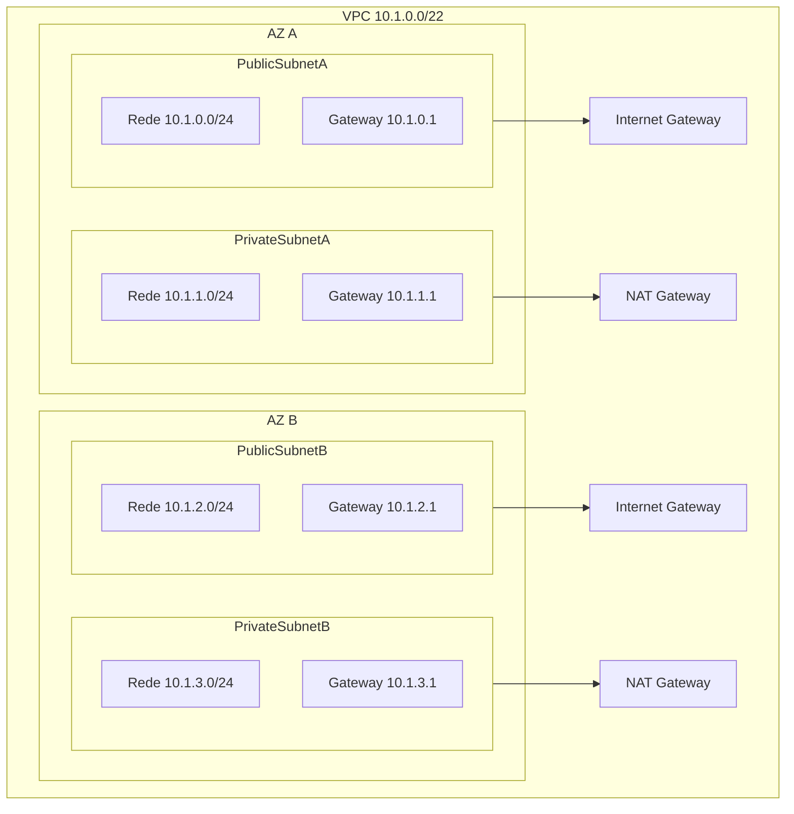

Nesse artigo vamos aprender os conceitos básicos da AWS na prática utilizando um cenário real de migração para cloud.

### 1- Migrando uma SMB de on premises para AWS

- Vamos Utilizar: IAM, EC2, EBS, S3, RDS, S3, ELB, AWS Backup, VPC,  Application Migration Service
#### Avaliando os Requisitos

*Qual o Négocio*?
  - Empresa de varejo, com lojas físicas, tipo americanas e casas Bahia.
  - 10 Filiais, sendo 5 em Shopping
  - Funciona de 08:00 as 22:00 de segunda a sábado
  - Lojas de Shopping abrem de 14:00 as 22:00 no Domingo
  - 5 pontos de vendas por loja (50 total)
  - 20 Usuários no Escritório
   

Para definir quais sistema a empresa vai usar, resolvi seguir as informações da [EAESP, da FGV](https://eaesp.fgv.br/producao-intelectual/pesquisa-anual-uso-ti). 

![[Pasted image 20240310160830.png]]
*O SO mais usado em servidores é Windows.*

![[Pasted image 20240310161050.png]]
*O Linux tem crescido, mas tá longe de ser o padrão*

![[Pasted image 20240310161353.png]]
*Nos desktops o Windows mantem a dominância, ainda vai chegar o ano do Linux do desktop*

![[Pasted image 20240310161703.png]]
*Sistemas ERP mais usados*

![[Pasted image 20240310171637.png]]
*Banco de dados*

Levando em consideração esses dados, nossa empresa vai seguir esse padrão, maioria dos servidores Windows, Desktop Windows, 

Para o ERP Vamos seguir a média dos requisitos dos ERP mais usados, lembrando que estamos tomando como referencia somente, não estamos simulando a instalação e migração real dessa aplicação.

Nossa empresa tem apenas 20 usuários para o ERP, portanto:
- Cada usuário consome 200MB então 20 x 200 4000MB + 8196MB(Para o SO) = 12GB no servidor de aplicação.
- 8vCPU, ele recomenda 4 CPU físicas para até 100 usuários, como vamos usar virtualização, então 8vCPU, 4 cores + HyperThread. 

| Servidor de Aplicação | Virtual        |
| --------------------- | -------------- |
| Sistema Operacional   | Windows Server |
| CPU                   | 8vCPU          |
| Mémoria RAM           | 12 GB          |
| Disco SO + PageFile   | 50GB           |
| Disco Dados           | 200 GB         |

O cliente (é uma aplicação cliente servidor), no momento é instalada em cada desktop da empresa.
Aplicação Cliente

- CPU: 5% a 30% de uso do processador.
- Memória RAM: 100 MB a 1 GB de memória.
- Rede: 1 MB a 10 MB de largura de banda por hora de uso.

Para o banco de dados, vamos usar o MySQL.

| Servidor de Aplicação | Bare Metal |
| --------------------- | ---------- |
| Sistema Operacional   | Debian     |
| CPU                   | 4 CPU      |
| Mémoria RAM           | 32 GB      |
| Disco SO              | 100GB      |
| Disco Dados           | 500 GB     |

***O que tem na empresa***
 - 1 Servidor de Aplicação Windows (Todas roles da aplicação estão nesse servidor)
 - 1 Banco de dados Linux
 - 1 Servidor de Arquivos Windows
 - 1 Servidor de Impressão Windows
 - 1 Active directory Windows
 - 1 Zabbix Linux
 - 1 DHCP 
 - 1 DNS Windows

***Diagrama da Empresa***

```mermaid


flowchart TB
classDef blue fill:#40e0d0
classDef green fill:#50c878
classDef yellow fill:#ffd700
classDef darkblue fill:#5c9dca
classDef olive fill:#556b2f
classDef orange fill:#e47025
classDef brow fill:#634217
classDef red fill:#ce5a57
classDef darkgrey fill:#444c5c
classDef darkyellow fill:#e1b16a

subgraph Datacenter
    direction TB
    ST[(Storage)]:::darkyellow
	FS<-.->ST
    subgraph Rede Privada      
      direction TB
      RT{{"Roteador"}}:::green   
      SW1[Switch TOR]:::orange
      FW[Firewall]:::red   
      RT -.-> SW1
      FW -.-> RT     
    end  
    subgraph HyperVisor
    direction TB      
       DNSP(DNS Privado)     
       RDP[\"Terminal Server"\]:::olive
       FS[\"Servidor de Arquivos"\]:::olive
       APP[\"Aplicação Web"\]:::olive
	   SW1 --> DNSP & RDP & FS & APP         
	end
    subgraph Bare Metal
      DB[("Banco de Dados")]:::darkgrey
      DB1[("Banco de Stand BY")]:::darkgrey
      APP-.->DB
      RDP-.->DB
      DB<-.->DB1
	end
end

subgraph Escritorio
   direction TB
   RTE{{"Roteador"}}:::green 
   SWE["Switch"]:::orange
   USRE>"Usuarios"]:::darkblue
   USRE-.->SWE-.->RTE
end
subgraph Filiais
    direction TB
	RTF{{"Roteador"}}:::green 
	SWF["Switch"]:::orange
	USRF>"Usuarios"]:::darkblue
	USRF-.->SWF-.->RTF
end


MPLS("MPLS")
IE(("Internet"))
MPLS-.->FW 
RTF-.->MPLS
RTE-.->MPLS
IE<-.->FW
 

```

#### *Porque migrar?*

Uma parte importante de migrar ou não para cloud, requer analises de objetivos do negócio, analise de custos, arquitetura de aplicativos, segurança, desempenho.

*Quais gaps precisam ser resolvidos*
- Negócio: A empresa está crescendo e o ambiente atual não suporta as demandas, umas das soluções é adquirir mais hardware
- Segurança física: A única proteção de acesso aos servidores é uma chave.
- Energia: A sala de dados possui somente em no-break que suporta 2 horas sem energia, e possui somente um fornecedor de energia externa.
- Disponibilidade
- Escalabilidade
- Backup são feitos localmente

O que é cloud?

#### *Datacenter Tiers*

Os "tiers" de data centers referem-se a um sistema de classificação que descreve a disponibilidade e confiabilidade das instalações de um data center. Existem quatro níveis principais, cada um representando um padrão de infraestrutura e redundância, conforme definido pelo [Uptime Institute](https://uptimeinstitute.com/) :

- Tier 1: O Tier 1 é o nível básico e oferece a menor disponibilidade. Geralmente, possui uma infraestrutura simples, sem redundância de componentes críticos. Pode ser propenso a interrupções para manutenção e atualizações.
- Tier 2: O Tier 2 oferece um pouco mais de confiabilidade que o Tier 1, com alguma redundância em componentes críticos, como fontes de energia e sistemas de refrigeração. No entanto, ainda pode ser interrompido para manutenção planejada.
- Tier 3: O Tier 3 é projetado para fornecer uma maior disponibilidade do que os níveis anteriores. Possui redundância em todos os componentes críticos e permite a manutenção sem interrupção dos serviços. Geralmente, possui N+1 de redundância, o que significa que há backup completo para todos os componentes essenciais.
- Tier 4: O Tier 4 é o nível mais alto de disponibilidade e confiabilidade. Ele oferece redundância completa em todos os aspectos, incluindo energia, refrigeração, conectividade de rede e segurança. Além disso, é projetado para suportar falhas individuais sem interrupção dos serviços. Os data centers Tier 4 são os mais caros de construir e operar, mas oferecem o mais alto nível de garantia de tempo de atividade.

Lista de Datacenters certificados pelo [Instituto Uptime](https://uptimeinstitute.com/uptime-institute-awards/country/id/BR), a maioria são Tier 3.

![[Pasted image 20240308202347.png ]]
*Mapa de datacenters certificados espalhados pelo Brasil*

Verificando na lista, vamos ver que temos empresas especializadas em datacenter, bancos e empresas governamentais em sua maioria, até grandes empresas não desfrutam de ter um próprio datancer, inclusive cloud providers tem seus servidores em colocation com em empresas como Equinix, Tivit e Ascenty por exemplo.
Sendo assim a nossa empresa tem duas opções disponíveis para alcançar suas metas dentro do seu budget, colocation e cloud.

 
#### ***Regiões e Zonas  AWS***
  
As regiões e zonas da Amazon Web Services (AWS) são parte da infraestrutura global da AWS para hospedar serviços em nuvem. 

1\. Regiões: As regiões da AWS são áreas geográficas separadas que consistem em várias zonas de disponibilidade. Cada região é composta por dois ou mais data centers que são isolados fisicamente e estão localizados em áreas distintas para aumentar a resiliência e a disponibilidade dos serviços. As regiões da AWS estão localizadas em todo o mundo e permitem que os clientes implantem aplicativos em locais geograficamente diversos para melhorar a resiliência e a latência.
    
2\. Zonas de Disponibilidade: As zonas de disponibilidade são data centers isolados dentro de uma região que são conectados por redes de baixa latência e alta largura de banda. Cada zona de disponibilidade é projetada para ser independente das outras zonas, com infraestrutura de energia, refrigeração e rede próprias. Isso significa que uma falha em uma zona de disponibilidade não afetará as outras.
    
Em resumo, as regiões da AWS representam áreas geográficas distintas, enquanto as zonas de disponibilidade são data centers isolados dentro dessas regiões.  

![[Pasted image 20240308211253.png]]
[*Infraestrutura Global da  Aws*](https://aws.amazon.com/pt/about-aws/global-infrastructure/regions_az/)

### Criando a Infraestrutura na AWS

#### ***1\. Criando usuários usando o IAM***

Vamos pular a parte de criar a conta na AWS, para não ficar tão longo, já que o processo é simples, qualquer dúvida, pode olhar na [documentação oficial](https://docs.aws.amazon.com/accounts/latest/reference/welcome-first-time-user.html)
Vamos criar um usuário no Aws Console, não é recomendado usar a conta root para tarefas guarde ela para caso haja algum problemas nas contas Admin e precise recupera-las, logado com sua conta root.

Regras básiocas sobre usuários, grupos e politicas

- As permissões na AWS são definidas por politicas
- Há politicas pré definidas com diferentes tipos de acesso nos serviços da AWS, como leitura, escrita e acesso total.
- Uma política pode ser aplicada a um Grupo ou diretamente a um usuário(para facilitar a gestão melhor aplicar sempre a grupos) 
- Um grupo pode receber N politicas
- Um usuário pode participar de N grupos
- Um grupo não pode ser membro de outro grupo
- Quando um usuário pertence a mais de um grupo, as politicas aplicadas aos grupos que ele pertence são somadas.

![[Pasted image 20240309122254.png]]

Seguindo na prática

***[1\. Vá até Página inicial do console | Página inicial do console | sa-east-1](https://sa-east-1.console.aws.amazon.com/console/home?region=sa-east-1)***

2\.  Na barra de pequisa digite IAM

3\.  Selecione em services, IAM, marque a estrela se quiser deixar nos favoritos.

4\. Primeiro vamos criar um Grupo e definir as permissões.

5\. Click em Grupos de usuários

6\. Click em Criar grupo

7\. Escolha um nome para o grupo, esse nome é exclusivo somente na sua organização.

8\. Marque a política padrão, Administrator Access. Há várias predefinições de politica, o recomendado é ser mais específico possível e habilitar somente o recurso que cada Time precisa para efetuar o seu trabalho, no caso vamos escolher administradores, para seguir esse tutorial. 

9\. Click on Criar grupo

10\. Com o grupo criado agora vamos criar o usuário, click em Usuários

11\. Click em Criar usuário

12\. Escreva o nome de usuário, ele é exclusivo somente dentro da organização. Não é recomendado o uso de usuários genéricos, então crie um usuário para cada pessoa do time.

13\. Marque Fornecer acesso ao Console

14\. Escolha Quero criar um usuário do IAM

15\. Click em Próximo

16\. Em grupo de usuários escolha o grupo que acabamos de criar

17\. Click em Próximo

18\. Click em Criar usuário

19\. Conta Usuário criado com êxito, na tela de criação podemos obter a senha do usuário, que deixamos em criar automaticamente, e o login direto para a console.

20\. Efetue logoff com a conta Root e logue com o usuario IAM criado.

#### ***2\. Configurando o Budget na AWS***

Importante saber que na AWS não conseguimos travar os gastos com os serviços, uma maneira de controlar os gastos é criando budgets, com os budgets podemos definir um valor e receber alertas quando ele for atingido.

1\.Vá até a Página inicial do console

2\. Escreva billing na barra de pesquisa

3\. (opcional) Marque a estrela para deixar nos favoritos

4\. Click em Billing and Cost Management

5\. Click em Orçamentos

6\. Click em Criar um orçamento

7\. Escolha Orçamento de gasto zero, e digite o email para onde serão envidas as notificações.

8\. Click em Criar orçamento

9\.Seu orçamento My Zero-Spend Budget foi criado.

10\. Vamos criar agora um orçamento mensal estipulando um valor,  Click em Criar orçamento.

11\. Click em Use as configurações recomendadas. Você pode alterar algumas opções de configuração após a criação do orçamento.

12\. Click em Crie um orçamento mensal que notifique se você exceder ou estiver previsto para exceder o valor do orçamento.

13\. Vou colocar 5 doláres

14\. Digite o email para onde serão enviadas as notificações

15\. Click em Criar orçamento

16\. Seu orçamento My Monthly Cost Budget foi criado.

17.\ Em explorador de custos você tem um relatório com os gastos, com opção de vários filtros, como intervalo de datas e nome de serviços entre outros, se você usou algum serviço Free Tier, você pode visualizar o quanto usou dele em nível gratuito.

![[Pasted image 20240309130128.png]]

#### ***3\. Criando a infra de redes VPC***

O primeiro item de infraestrutura que vamos criar é a rede, você pode criar outros itens não tendo a rede criada, mas nesse caso a AWS vai criar automaticamente uma rede padrão para este serviço.
A Vamos criar duas subnets uma vai ter ip público, vai poder ser  e outra vai ter apenas ips privados. 
Nossa infra não será muito grande, por isso vamos uma VPC /22 vai ser suficiente.
Dúvidas sobre CIDRs, pode olhar nessa documentação da [Digital Ocean](https://www.digitalocean.com/community/tutorials/understanding-ip-addresses-subnets-and-cidr-notation-for-networking).

Os 3 Primeiros ips de cada subrede são reservados pela AWS, o primeiro ip é para o VPC Router (Gateway), o segundo é o DNS da Amazon, o terceiro está reservado para uso futuro.
Lembrando que o primeiro ip da Subnet é o id de rede, é o ultimo é o ip de Broadcast, que também não podem serem usados.

Diagrama da rede.

#### *4\. Criando uma VM usando EC2*

#### ***5\. Conectando o ambiente on premises com a cloud***

Nessa etapa vamos criar uma VPN Ipsec entre a Digital Ocean e a AWS para simular a conexão entre o ambiente on premises com a cloud.

#### ***6\. Migrando servidores para AWS***

AWS Application migration service.

#### 7\. Migrando servidor de arquivos para S3.

#### 8\. Migrando Banco de Dados para Amazon RDS

#### 9.\ Implementando Backups

#### 10.\ Implementando Monitoramento CloudWatch

#### *11.\ Redirecionando os serviços para aws usando Route 53*

