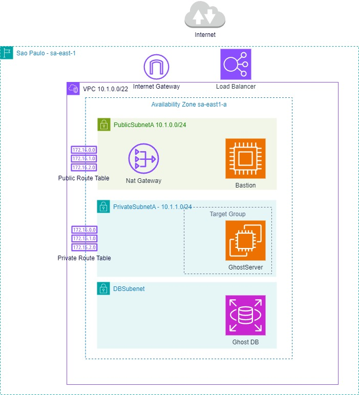
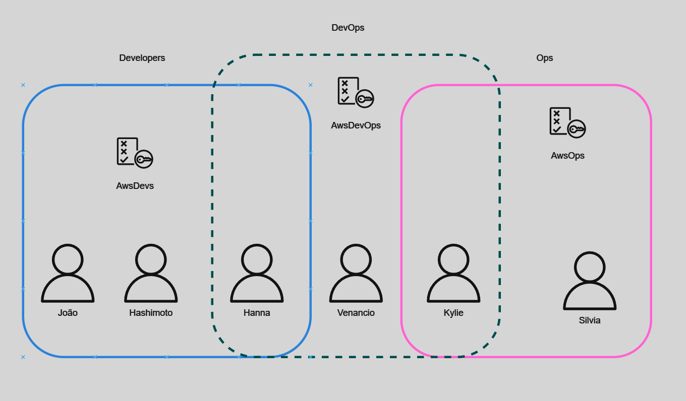
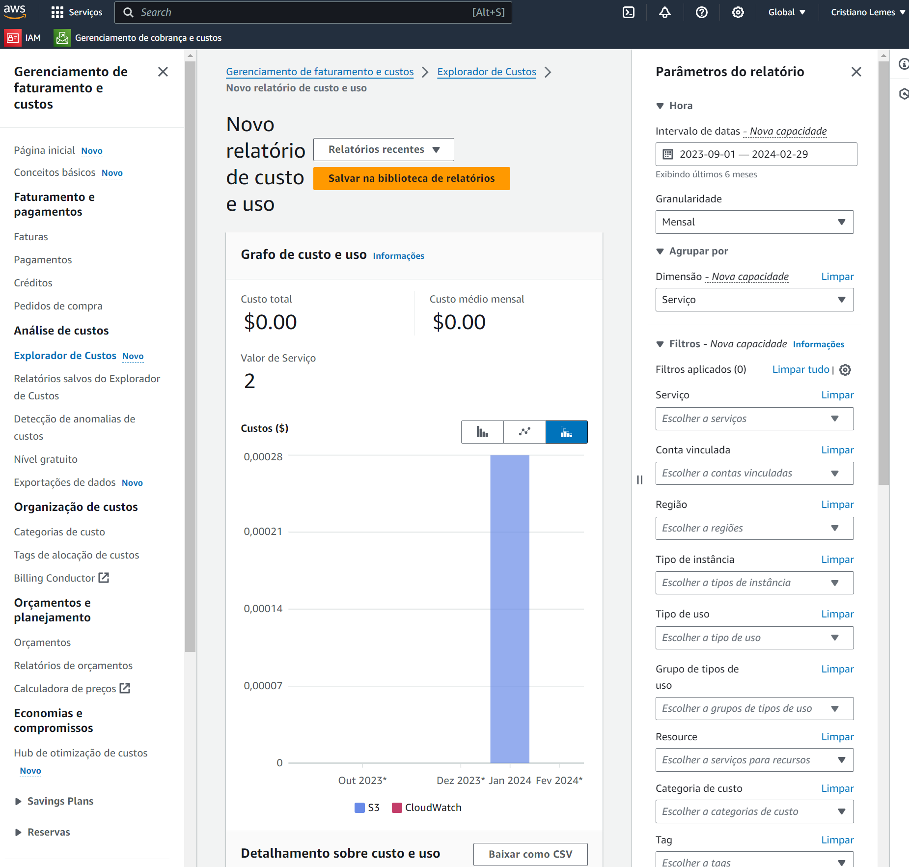
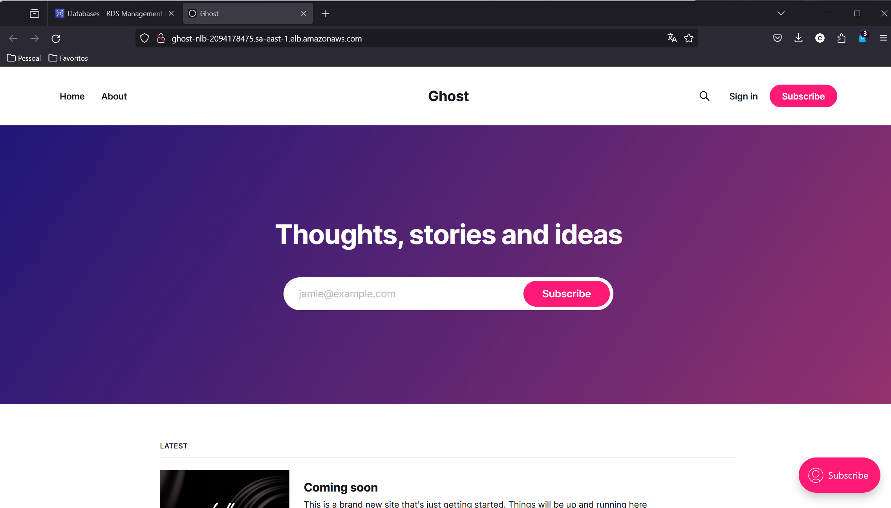

### Introdução

Neste artigo, vamos explorar os conceitos básicos da AWS na prática, utilizando um cenário de instalação de um blog usando Ghost.
Vamos utilizar uma variedade de serviços da AWS, incluindo:

- IAM
- VPC
- EC2
- EBS
- RDS
- ALB
### Criando a Infraestrutura na AWS





##### ***1. Criando usuários usando o IAM***

Vamos pular a parte de criar a conta na AWS, para não ficar tão longo, já que o processo é simples, qualquer dúvida, pode olhar na [documentação oficial](https://docs.aws.amazon.com/accounts/latest/reference/welcome-first-time-user.html)
Vamos criar um usuário no Aws Console, não é recomendado usar a conta root para tarefas guarde ela para caso haja algum problemas nas contas Admin e precise recupera-las.

##### 1.1. Regras básicas sobre usuários, grupos e politicas.

- As permissões na AWS são definidas por politicas
- Há politicas pré definidas com diferentes tipos de acesso nos serviços da AWS, como leitura, escrita e acesso total.
- Uma política pode ser aplicada a um Grupo ou diretamente a um usuário(para facilitar a gestão melhor aplicar sempre a grupos) 
- Um grupo pode receber N politicas
- Um usuário pode participar de N grupos
- Um grupo não pode ser membro de outro grupo
- Quando um usuário pertence a mais de um grupo, as politicas aplicadas aos grupos que ele pertence são somadas.


*Relação entre grupos, políticas e usuários
##### 1.2. Criando um Grupo e definindo permissões

- Vá até Página inicial do console
- Na barra de pequisa digite **IAM**
- Em services, **IAM**, marque a estrela se quiser deixar nos favoritos.
- Click em **User Groups**
- Click em **Create Group**
- Escolha um nome para o grupo, esse nome é exclusivo somente na sua organização.
- Marque a política padrão, **Administrator Access**. 
	*Há várias predefinições de políticas, e você também pode criar novas, o recomendado é ser mais específico possível e habilitar somente o recurso que cada time precisa para efetuar o seu trabalho, no caso vamos escolher administradores, para seguir esse tutorial.*
- Click em **Create group**


##### 1.3. Criando o usuário e adicionando ao grupo criado

- Estando em IAM, click em **Users**
- Click em **Create User**
- Em ***User details**, escreva o nome de usuário, ele é exclusivo somente dentro da organização. Não é recomendado o uso de usuários genéricos, então crie um usuário para cada pessoa do time.
-  Marque **Provide user access to the AWS Management Console** 
- Escolha **I want to create an IAM user.**
- Click em **Next**
- Em **User groups** escolha o grupo que acabamos de criar, no caso AWS-Admins
- Click em **Next**
- Click em **Create User**
- Conta de Usuário criado com êxito, na tela de criação podemos obter a senha do usuário, que deixamos em criar automaticamente, e o login direto para a console.
- Efetue logoff com da conta root e logue com o usuário IAM criado.


#### ***2. Configurando o Budget na AWS***

Importante saber que na AWS não conseguimos travar os gastos com os serviços, uma maneira de controlar os gastos é criando budgets, com os budgets podemos definir um valor e receber alertas quando ele for atingido.

##### 2.1. Criando um Orçamento custo zero.

- Vá até a Página inicial do Aws console
- Escreva **billing** na barra de pesquisa
- Click em **Billing and Cost Management**
- Marque a estrela para deixar nos favoritos (opcional)
- Click em **Budgets**
- Click em **Create a Budget**
- Escolha *Use a template (simplified)*
- Escolha **My Zero-Spend Budget**
- Digite o email para onde serão envidas as notificações.
- Click em **Create budget**
- Seu orçamento **My Zero-Spend Budget** foi criado.


##### 2.2. Criando um orçamento mensal estipulando um valor  

- Estando em  **Billing and Cost Management**
- Click em **Budgets**
- Click em **Create Budget**
- Escolha *Use a template (simplified)*
- Escolha **Monthly cost budget**
- Vou colocar 5 doláres
- Digite o email para onde serão enviadas as notificações
- Click em **Create budget**
- Seu orçamento My Monthly Cost Budget foi criado.


##### 2.3. Analisando Custos

Em explorador de custos você tem um relatório com os gastos, com opção de vários filtros, como intervalo de datas e nome de serviços entre outros, se você usou algum serviço Free Tier, você pode visualizar o quanto usou dele em nível gratuito.




#### ***3. Criando a infraestrutura de redes***

O primeiro item de infraestrutura que vamos criar é a rede, você pode criar outros itens não tendo a rede criada, mas nesse caso a AWS vai criar automaticamente uma rede padrão para este serviço.
Vamos criar duas subnets uma vai ter ip público, vai poder ser  e outra vai ter apenas ips privados. 
Nossa infra não será muito grande, por isso vamos uma VPC /22 vai ser suficiente.

Os 3 Primeiros ips de cada subrede são reservados pela AWS, o primeiro ip é para o VPC Router (Gateway), o segundo é o DNS da Amazon, o terceiro está reservado para uso futuro.
Lembrando que o primeiro ip da Subnet é o id de rede, é o ultimo é o ip de Broadcast, que também não podem serem usados.

###### 3.1 Overview serviços da VPC

- ***VPC:*** Significa Virtual Private Cloud, permite que você crie uma rede virtual, permitindo isolamento entre recursos.
- ***Subnet:*** É uma subdivisão do intervalo de ip da VPC, serve para organizar, criar rotas, regras de segurança, permitindo uma gerencia do tráfego na VPC.
- ***RouteTable:*** É uma tabela de roteamento, que por padrão já adiciona automaticamente todas rotas da VPC, você vai adicionar manualmente rota para fora da vpc, como outras vpcs, serviços da Aws como s3 e rds, e rotas para internet.
- ***Nat Gateway:*** É um roteador que não está voltado para internet, não fornecendo ip publico para as instancias, ele é totalmente gerenciado pela AWS, possuindo alta disponibilidade, escalabilidade e segurança nativos.
- ***Internet Gateway:*** É um roteador que fornecesse acesso a internet, tanto atribuindo um ip público diretamente a instância, como fornecendo internet atraves de NAT pelo Nat gateway.
- ***Security Groups:*** Age como firewall, permitindo que você controle o tráfego de redes com base de regras, é atribuído a nivel de instância,  configurando regras baseado em endereços IP de origem ou destino, portas e protocolos, como TCP, HTTP. Uma importante saber, é que as regras são statefull, significa que ele salva o estado das conexões, portanto quando você crie uma regra, as repostas de saídas já são liberadas automaticamente.
- ***NACL:*** Siginifica Network Access Control List, ele adiciona mais uma camada de segurança, ele é associado a subrede, quer dizer, as regras são aplicadas a todas as instancias dentro da mesma subrede por padrão já vem com tudo liberado, do mesmo modo que security group você pode criar regras com ips, portas e protocolos de origem, mas você pode tanto permitir quando negar um acesso, e seguem a ordem que você estabelece numericamente, parando de processar quando tem o match. Importante saber que ele é stateless, não salva o estado das conexões, quer dizer, quando criar uma regra de entrada tem que criar também a regra de saída. 
- ***VPC Endpoints:*** VPC Endpoints fornecem conexões diretas a serviços gerenciados pela AWS, como S3, DynamoDB e SNS, sem a necessidade de roteamento pela Internet pública. Eles garantem uma comunicação segura e eficiente entre a VPC e esses serviços, contribuindo para uma arquitetura mais robusta e segura na nuvem.

##### 3.2. Criando uma VPC

- Vá até a Página inicial do Aws console
- Escreva **vpc** na barra de pesquisa
- Click em **VPC**
- Marque a estrela para deixar nos favoritos (opcional)
- Click em **Create VPC**
- Marque **VPC only**
- Em Name tag, coloque o nome da rede vpc-01
- Deixe marcado **IPv4 CIDR block**
- Em **IPv4 CIDR4** coloque **10.1.0.0/22**
- Deixe marcado **No IPv6 CIDR block**
- Click em **Create VPC**


##### 3.3. Criando Subnets

Vamos criar duas subnets na AZ a, uma pública e outra privada.

- Estando em VPC
- Click em **Subnets**
- Em **VPC ID** escolha a VPC que acabamos de criar
- Em **Subnet settings** click em Add New Subnet, 2 vezes.
- Primeira subnet
	- Subnet name: PublicSubnetA
	- Availability Zone: sa-east-1a
	- IPv4 subnet CIDR block: 10.1.0.0/24
- Segunda subnet
	- Subnet name: PrivateSubnetA
	- Availability Zone: sa-east-1a
	- IPv4 subnet CIDR block: 10.1.1.0/24

  

##### 3.4. Configurando a subnet pública

***3.4.1.  Habilitando Subnet para receber ips públicos por padrão***
- Estando em VPC
- Click em **Subnets**
- Na lista de subnets , click com botão direito em PublicSubnetA, escolha **edit subnet settings**
- Em Auto-assign IP settings, marque a opção **Enable auto-assign public IPv4 address**
- Click em save


***3.4.2. Criando um internet gateway***
- Estando em VPC
- Click em **Internet gateways**
- Click no botão **Create internet gateways**
- Em Name tag, vamos colocar **IGW01**
- Click em **Create internet gateway** 


***3.4.3. Anexando o internet gateway a VPC***
- Estando em VPC
- Em **Internet gateways**
- Na lista de Internet gateways , click com botão direito em IGW01, escolha **attach to VPC**
- Em available VPCs, click em *Attach internet gateway*


***3.4.4 Criando a tabela de roteamento***

- Estando em VPC
- Vá em Rote Tables
- Click no botão **Create route table**
- Em name vamos colocar, **PublicRouteTable**
- Em VPC, vamos selecionar **vpc-01**
- Click em **Create route table**


***3.4.5. Criando rota padrão na subnet pública

- Estando em VPC
- Vá em Rote Tables
- Selecione a rota PublicRouteTable
- Click em Actions e em Edit Routes
- Note que já existe uma rota padrão para VPC local
- Em edit routes, click em *Add route*
- Ele vai criar uma entrada Route 2
- Em destination coloque 0.0.0.0/0¹
- Em target, selecion Internet Gateway
- Selecione o IGW01
- Click em Save changes

1. A rota 0.0.0.0/0 vai encaminhar toda rota que não estiver definida explicitamente para o internet gateway.


***3.4.6. Associando a route table a subnet pública***

- Estando em VPC
- Vá em Rote Tables
- Selecione a rota PublicRouteTable
- Click em Actions e em Edit subnet associations
- Em Available subnets 
- Marque PublicSubnetA
- Click em Save associations
 


##### 3.5 Configurando a subnet privada

***3.5.1. Criando um NAT gateway***
- Estando em VPC
- Click em **NAT gateways**
- Click no botão **Create NAT gateways**
- Em Name tag, vamos colocar **NATGW01**
- Em subnet vamos escolher **PublicSubnetA¹**
- Connectivity type Public
- Em Elastic IP allocation ID, click Allocate Elastic IP²
- Click em **create NAT gateway**

1. O NATGateway não pode estar na mesma subnet que será usado, e ele precisa de um internet gateway para sair para internet, por isso estamos colocando na PublicSubnetA para ser usado pela PrivateSubnetA.
2. O Elastic IP é um ip publico que vai ficar reservado a sua conta, ele não é apagado quando deletamos o objeto que ele está associado, ex: se apagar o NAT gateway, o elastic ip vai continuar existindo, só será desalocado e poderá ser usado por outra instância. 
3.  O NAT Gateway é cobrado por hora, mesmo não sendo usado.


***3.5.2. Criando a route table privada***

- Estando em VPC
- Vá em Rote Tables
- Click no botão **Create route table**
- Em name vamos colocar, **PrivateRouteTable**
- Em VPC, vamos selecionar **vpc-01**
- Click em **Create route table**


***3.5.3.  Criando rota padrão na subnet privada***

- Estando em VPC
- Vá em Rote Tables
- Selecione a rota PrivateRouteTable
- Click em Actions e em Edit Routes
- Em edit routes, click em *Add route*
- Ele vai criar uma entrada Route 2
- Em destination coloque 0.0.0.0/0
- Em target, selecione NAT Gateway
- Selecione o NATGW01
- Click em Save changes


***3.5.4. Associando a route table a subnet privada***

- Estando em VPC
- Vá em Rote Tables
- Selecione a rota PrivateRouteTable
- Click em Actions e em Edit subnet associations
- Em Available subnets 
- Marque PrivateSubnetA
- Click em Save associations


#### *4. Criando um Security Group

- Vá até a Página inicial do Aws console
- Escreva **vpc** na barra de pesquisa
- Click em **VPC**
- No menu lateral navegue até **Security**
- Em Security click em **Security groups**
- Click no botão **Create security group**
- Vamos chamar de **WebServers**
- Em **Description**, vamos colocar, *Allows ssh and https access*
- Em **VPC** escolha a **vpc-01**
- Em **Inbound rules** click em **Add rule**
- Em **Type**  escolha **http**
- Em Source escolha **Anywhere IPv4**
- Vamos adicionar mais duas regras
- Click em **Add rule**
- Em **Type**  escolha **https**
- Em Source escolha **Anywhere IPv4**
- Click em **Add rule**
- Em type escolha **ssh**
- Em Source escolha **Anywhere IPv4**¹
- Click em **Create security group**


1.  Em source,  por segurança, você pode escolher a opção My IP, ele vai pegar seu ip atual de internet, mas lembre que normalmente você recebe ip dinâmico em internets domesticas, deste modo, se você perdeu o acesso, vale verificar se seu ip mudou.


#### *5. Criando uma VMs usando EC2*

***5.1. Criando um Bastion Host***
Como a máquina de produção não estará de frente para internet, vamos criar uma vm na internet publica e a partir dela acessar a maquina que estará na rede privada.

- Vá até a Página inicial do Aws console
- Escreva **EC2** na barra de pesquisa
- Click em **EC2**
- Marque a estrela para deixar nos favoritos (opcional)
- No menu lateral click em *Instances*
- Em **Instances**, click em **Launch instances**
- Em Name and Tags, vamos colocar **Bastion**
- Em Application and OS images, escolha **Amazon Linux 2023**
- Em Instance type, escolha t2.micro
- Em key pair, click em **Create new key pair**
- Vamos colocar o nome de *bastionkey*, manter as opções RSA e .pem.¹
- Ele vai baixar o .pem automaticamente para sua máquina, certifique-se de colocar em um local acessível para usarmos no futuro.
- Em Network settings, vamos clicar em **Edit**
- Em VPC, escolha a vpc01
- Em Subnet, escolha PublicSubnetA
- Auto-assign public IP, mantenha **Enabled**
- Em Firewall Security Group, escolha **WebServers**.
- As demais opções, mantenha no padrão
- Click no botão, **Launch intance**.


1. Se você usa Windows anterior a Windows 10, vai ter que gerar uma chave .ppk, para ser usada no aplicativo Putty.

***5.2. Criando o servidor Ghost***

- Estando em **EC2**
- No menu lateral click em *Instances*
- Em **Instances**, click em **Launch instances**
- Em Name and Tags, vamos colocar **GhostServer**
- Em Application and OS images, escolha **Ubuntu 22.04 LTS** 
- Em Instance type, escolha t2.micro
- Em key pair, click em **Create new key pair**
- Vamos colocar o nome de ghostkey, manter as opções RSA e .pem.
- Em Network settings, vamos clicar em **Edit**
- Em VPC, escolha a vpc01
- Em Subnet, escolha PrivateSubnetA
- Auto-assign public IP, mantenha Disable
- Em Firewall Security Group, escolha WebServers.
- As demais opções, mantenha no padrão
- Click no botão, **Launch intance**.


***5.3. Instalando os requisitos para aplicação***

5.3.1. Conectando à instancia usando **EC2 Instance Connect**

- Em instances, selecione a instância, **Bastion**
- Em Actions click em **Connect**
- Em **Connect to Instance** 
- Selecione a aba **EC2 Instance Connect**
- Em connection type, certifique-se que está **Connect use EC2 Instance Connect**
- Click no botão **Connect
- Ele vai abrir um nova via conectada ao shell do servidor


5.3.2. Conectando ao servidor usando o cliente de ssh

- Em Instances, selecione a instância, **Bastion**
- Em Actions click em **Connect**
- Em **Connect to Instance** 
- Selecione a Aba **SSH client**
- Certifique-se que seu arquivo pem está de acordo com as instruções
- Copie o comando em  **example de conexão de ssh**
- Abra seu terminal e execute o comando de conexão
- Exemplo:

```bash
ssh -i "bastionkey.pem" ec2-user@54.207.206.108
```


5.3.3. Instalação dos pré-requisitos

- Em Instances, selecione GhostServer
- Vá até a aba Networking
- Em private IPv4 Address, copie o ip.
- Abra o arquivo bastionkey.pem eu seu computador, usando um editor de texto
- Copie todo conteúdo do arquivo
- Conecte-se ao host Bastion
- Crie um arquivo novo chamado bastionkey.pem e cole o conteúdo copiado.
- Salve o arquivo e rode um chmod 400 para ajustar as permissões
- Conecte-se via ssh ao servidor GhostServer a partir do bastion
- Exemplo:

```bash
ssh -i "bastionkey.pem" ubuntu@10.1.1.156
```


5.3.4. Instalando os pré-requisitos para o Ghost

- Estando conectado ao GhostServer, siga os passos:
1. Crie o usuário para rodar a aplicação.
```bash
sudo adduser ghostuser 
```
- Ele vai pedir a senha, coloque uma senha forte.
2. Adicione o usuario ao grupo sudoers.
```bash
usermod -aG sudo ghostuser
```
3. Faça login com o usuário ghostuser
```bash
sudo su - ghostuser
```
4. Atualize o sistema
```bash
# Atualiza lista de pacotes
sudo apt-get update

# Atualiza os pacotes intalados
sudo apt-get upgrade
```
5. Instale o Ngnix
```bash
sudo apt-get install nginx
```
6. Configure o firewall do ubuntu para liberar as portas do Ngnix
```bash
sudo ufw allow 'Nginx Full'
```
7. Instale o Node.js
```bash
# Baixando e atualizando as chave GPG
sudo apt-get update
sudo apt-get install -y ca-certificates curl gnupg
sudo mkdir -p /etc/apt/keyrings
curl -fsSL https://deb.nodesource.com/gpgkey/nodesource-repo.gpg.key | sudo gpg --dearmor -o /etc/apt/keyrings/nodesource.gpg

# Adicione a fonte a lista de repositorios
NODE_MAJOR=18 # Verão mais nova suportada pela aplicação
echo "deb [signed-by=/etc/apt/keyrings/nodesource.gpg] https://deb.nodesource.com/node_$NODE_MAJOR.x nodistro main" | sudo tee /etc/apt/sources.list.d/nodesource.list

# Atualize a lista de pacotes, e instale o nodejs
sudo apt-get update
sudo apt-get install nodejs -y
```
8. Instale o Ghost Cli
```bash
sudo npm install ghost-cli@latest -g
```


#### ***6. Criando um Application LoadBalancer

6.1 Criando **Target Groups**

- Estando em **EC2**
- No menu lateral, na seção **Load Balancing** click em **Target Groups**
- Click no botão **Create taget group**
- Em **Basic Configuration**
- Em **Choose a target type** marque **Instances**
- Em **Target group name**, coloque **GhostServers**
- Em **Protocol: Port**  selecione **HTTP**
- Em **IP address type** selecione **IPv4**
- Em **VPC** selecione **vpc-01**
- Matenha as demais opções padrão e click em **Next**
- Em **Register targets**
- Em **Available instancess** selecione **GhostServer** 
- Click  no botão **Include as pending below**
- Click em **Create target group**


6.2 Criando o Application Load Balancer

É mandatório para ter duas subnets associadas ao Load Balancers, crie uma nova subnet publica, chamada PublicSubnetB, com endereço 10.1.2.0/24,  seguindo os passos da seção 3.3 deste artigo, mas na Az escolha sa-east-1b. Associe a PublicRouteTable a esta subnet.

- Estando em **EC2**
- No menu lateral, na seção **Load Balancing** click em **Load Balancers**
- Em **Load balancers**, click em **Create load balancer**
- Escolha **Application Load Balancers**, click  em **Create**
- Em base **Configuration**, coloque o nome **Ghost-nlb**
- Em **Scheme** marque **Internet facing**
- Em **IP Address Type** deixe marcado **IPv4**
- Em **Network mapping**, selecione a **vpc-01**
- Marque **sa-east-1a (sae1-az1)** e **sa-east-1b (sae1-az2)**
- Em **Security Group** selecione **WebServers**
- Em listener, matenha o protocolo **HTTP**
- Em **Default action**, em **Forward to**, selecione **GhostServers**
- Click em **Create load Balancer**


#### *7. Criando um o banco de dados usando RDS*

- Vá até a Página inicial do Aws console
- Escreva **RDS** na barra de pesquisa
- Click em **RDS**
- No menu lateral, click em **Databases**
- Click em **Create database**
- Em **Choose a database creation method**
- Escolha **Standard create**
- Em **Engine options**, Engine type, Escolha **MySQL**
- Em **Engine Version**, certifique-se de selecionar a versão 8
- Em Templates escolha **Free tier**
- Em **Settings**, DB instance identifier, coloque **GhostDB**
- Pode manter o **Master** como admin
- Em **Credentials Management**, escolha **Self managed**
- Coloque uma senha, e anote.
- Deixe as configurações de Storage padrão
- Em **Connectivity**, marque **Don't connect to an EC2 compute resource**
- Em **Virtual private cloud** escolha a **vpc-01**
- Em **DB subnet group** escolha, **Create  new DB Subnet Group**
- Em **Public access** marque **No**
- Em **VPC security group** marque **Create new**
- Em VPC security group name, coloque **sg-ghostdb**
- Em **Availability Zone** escolha **sa-east-1a**
- Deixe as demais opções no padrão e click em **Create database**


#### *8. Instalando a Aplicação (Ghost)*

 8.1 Obtendo Informações dos passos anteriores
- Em **Load balancers**, selecione Ghost-nlb
- Em **Details** copie o **DNS**
- Ex: Ghost-nlb-2094178475.sa-east-1.elb.amazonaws.com
- Em **RDS**, **Databases**, click em **ghostdb**
- Em **Connectivity & security**, copie o endereço do **Endpoint**
- Ex: ghostdb.c34m8468ic7f.sa-east-1.rds.amazonaws.com
- Tenha em mão o usuario e senha do banco de dados.

8.2 Instalando o Ghost

- Crie o diretório para a página do ghost, altere o owner e ajuste as permissões
```bash 
sudo mkdir -p /var/www/ghostweb
sudo chown ghostuser:ghostuser /var/www/ghostweb
sudo chown ghostuser:ghostuser /var/www/ghostweb
```

- Troque para o usuario ghostuser
```bash
sudo su - ghostuser
```

- Entre na pasta e execute a instalação
```bash
cd /var/www/ghostweb
```

- Execute o instalador
```bash
ghost install 
```
  
- Após checar o requisitos e baixar componentes, o instalador vai solicitar as informações do ambiente, favos informar conforme coletamos anteriormente.
 1. Enter your blog URL: http://ghost-nlb-2094178475.sa-east-1.elb.amazonaws.com
 2. Enter your MySQL hostname: ghostdb.c34m8468ic7f.sa-east-1.rds.amazonaws.com
 3. Enter your MySQL username: admin
 4. Enter your MySQL password: [hidden]
 5. Enter your Ghost database name: ghostdb
 6. Do you wish to set up Nginx? Yes
 7. Do you wish to set up Systemd? Yes
 8. Do you want to start Ghost? Yes

O ngnix retornou erro *nginx: [emerg] could not build server_names_hash, you should increase server_names_hash_bucket_size: 64
nginx: configuration file /etc/nginx/nginx.conf test failed* A solução foi ajustar o parametro **server_names_hash_bucket_size 128** no /etc/ngnix/ngnix.conf e reiniciar o ngnix.


### *9. Teste na Aplicação*

- Acessando a url do blog



Acessando a url admin.


### 10. Considerações finais.

Neste artigo, aprendemos a configurar e implantar um ambiente de hospedagem web utilizando o Ghost CMS, além de utilizar serviços da AWS como EC2, RDS, Load Balancer e Elastic IP. Inicialmente, criamos recursos na AWS como VPC, Subnets, Security Groups e Public Route Table. Em seguida, provisionamos as instâncias EC2 para o banco de dados (RDS) e os servidores web (Ghost). Ao implantar a aplicação Ghost, configuramos um balanceador de carga para distribuir o tráfego entre os servidores web. Após concluída a instalação e configuração das dependências, tivemos sucesso ao acessar o blog utilizando a URL fornecida pelo load balancer e também através do painel administrativo.